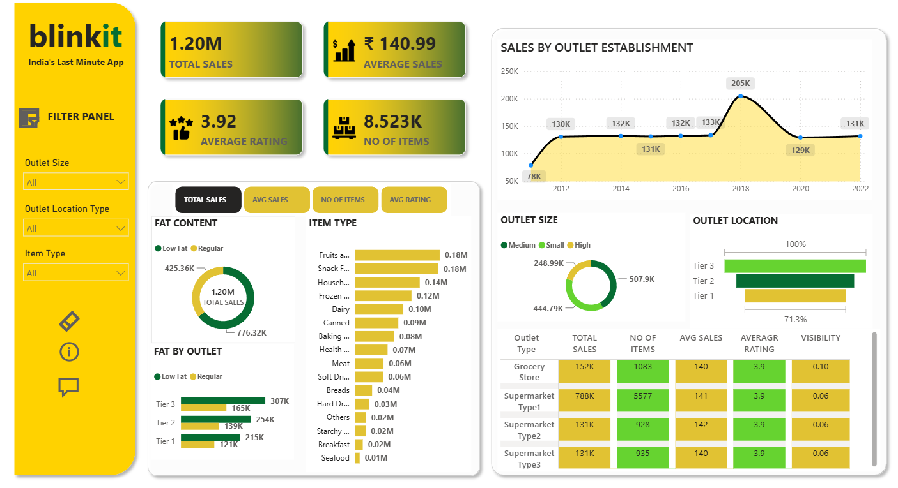

# Blinkit Sales Analysis Dashboard | Power BI

## 📊 Project Overview

An interactive Power BI dashboard developed to analyze Blinkit's sales performance, product trends, outlet performance, and customer preferences.

## 🎯 Objectives

- Analyze overall sales performance
- Identify top-performing product categories
- Compare outlet performance
- Analyze customer preferences
- Identify trends in sales across different outlet types

## 🛠️ Tools & Technologies

- Power BI
- DAX
- Power Query
- Excel
- Data Visualization

## 📈 Key Insights

- Total Sales: $1.20M
- Total Items: 8,523
- Analyzed outlet and product-level performance
- Identified key sales trends and high-performing categories

## 📂 Files

| File | Description |
|---|---|
| `Blinkit Sales Analysis.pbix` | Power BI dashboard |
| `dashboard.png` | Dashboard preview |
| `dataset.xlsx` | Dataset used for analysis |

## 📸 Dashboard Preview

